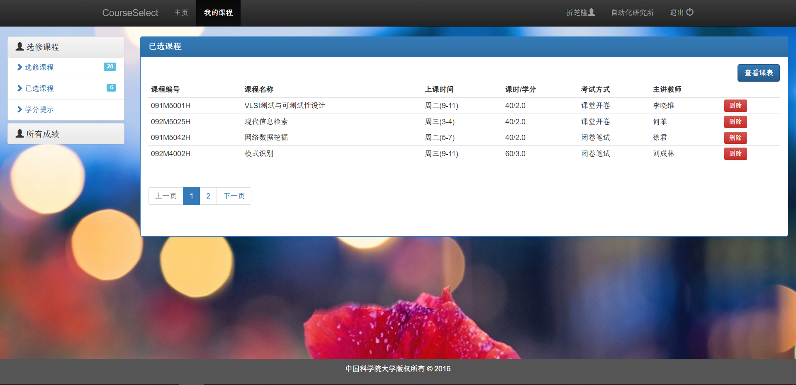
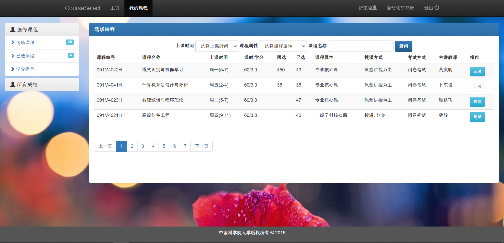
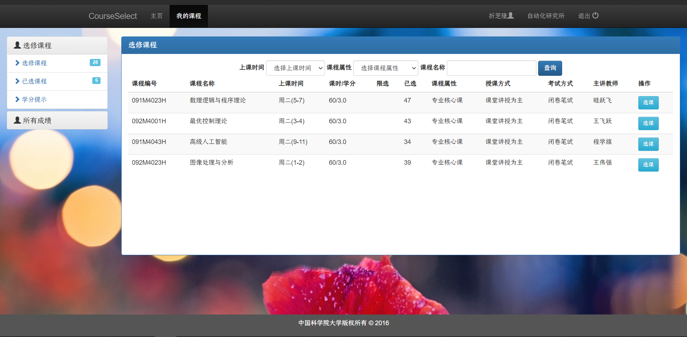
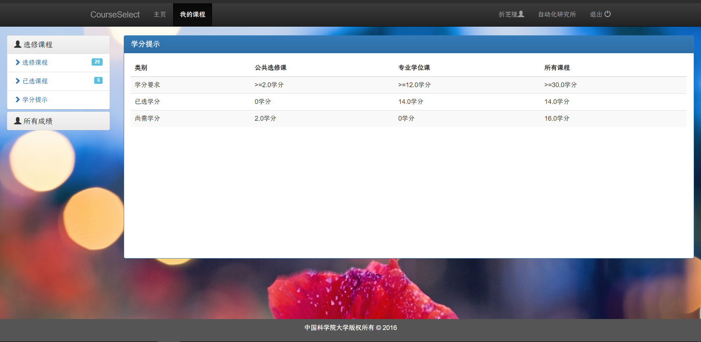
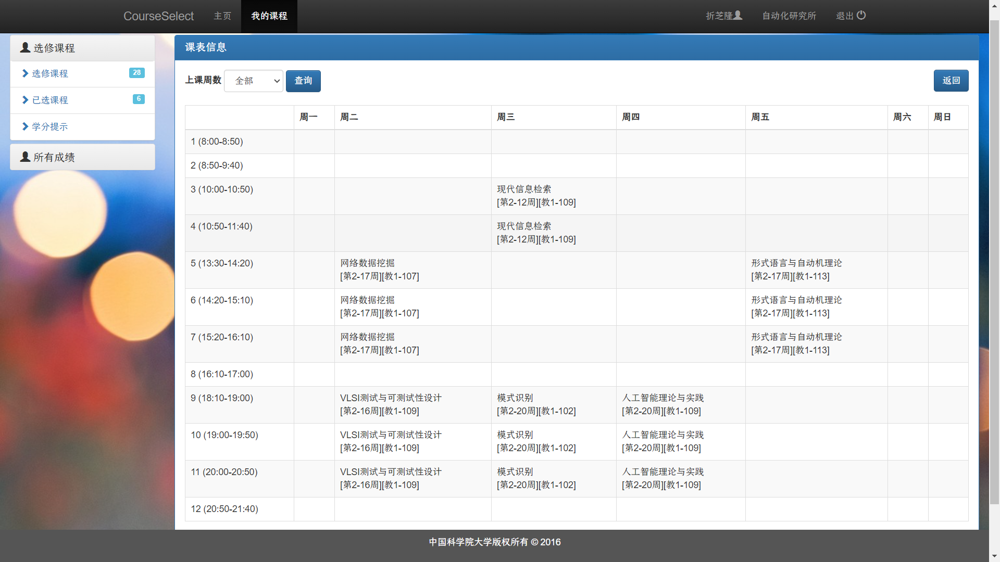
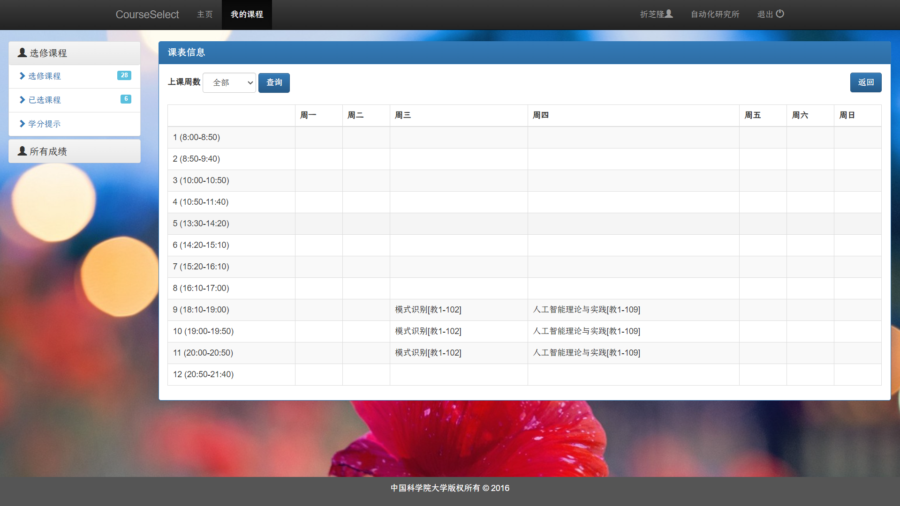
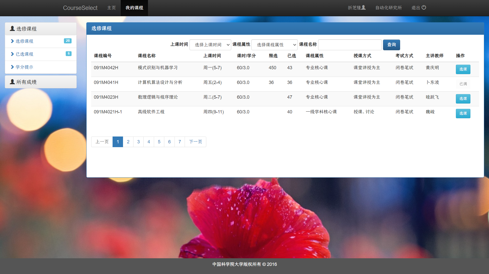
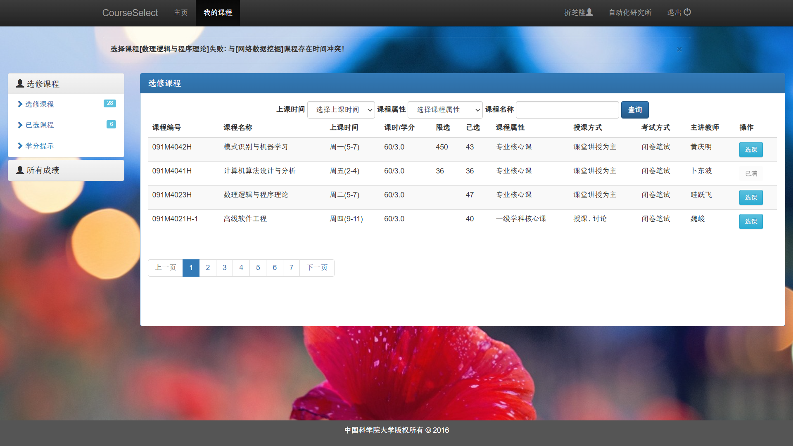
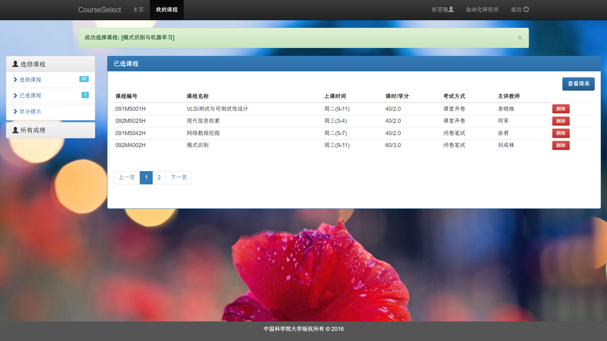

以下内容使用student1进行演示，账号：student1@test.com；密码：password。

# 任务一：课程查询

登录后，进入“我的课程”界面，可见如下内容：



点击“选修课程”：



可以设置上课时间、课程属性和课程名称作为过滤条件，筛选需要的课程。例如，设置上课时间为“周二”，课程属性为“专业核心课”后，点击“查询”按钮，可得到如下筛选后的课程：



# 任务二：学分统计

点击左侧导航栏中的“学分提示”，可见如下内容：



# 任务三：课表查看

点击左侧导航栏中的“已选课程”，可以发现右上角的“查看课表”按钮：


点击后可查看所有课程的总课表：



左上角另有“上课周数”的下拉菜单，可选择查看对应某周的课表。例如，查看第18周的课表：



最后，可点击右上角的“返回”按钮返回至“已选课程”界面。

# 任务四：选课冲突处理

本任务提出了三个要求：处理重复选课（即所选的课程已在已选课程中，不能重复选择）、处理选课人数已满和处理时间冲突。

- **重复选课处理**

实际上已选课程中已经排除了被选过的课程，因此用户不可能重复选择。相关代码如下：

``` ruby
# /app/controllers/courses_controller.rb
def list
  user_course_ids = current_user.courses.pluck(:id)
  @course_unselect = Course.where(open: true)
                           .where.not(id: user_course_ids)  # 在这里排除展示已选的课程
                           .paginate(page: params[:page], per_page: 4)
end
```

- **选课人数已满处理**

对于这类课程，“加入”操作按钮会变为“已满”且不可点击，例如下图中的“计算机算法设计与分析”课程：



- **时间冲突处理**

如果所选课程与已选课程时间冲突，用户无法加入此课程，且会提示选课失败。例如，在上面的课表展示中，可发现该学生第2-17周的周二5-7节有“网络数据挖掘”课。此时，如果在选修课程中加入“数理逻辑与程序理论”（该课程在第2-20周的周二5-7节开课），会出现如下界面：



上方提示**选择课程[数理逻辑与程序理论]失败：与[网络数据挖掘]课程存在时间冲突！**，且该课程无法加入已选课程。

如果选课不冲突，例如选修“模式识别与机器学习”（该课程在第2-20周的周一5-7节开课），则会显示选课成功：


